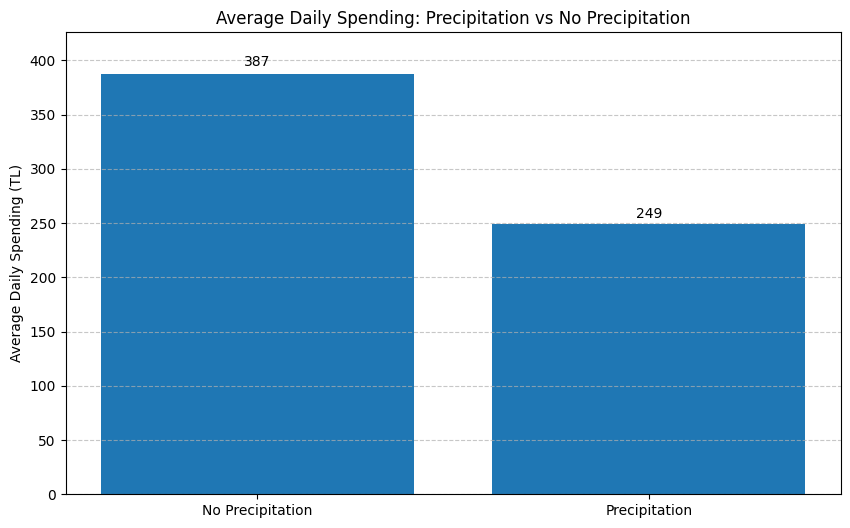

# **DSA210 Term Project: Weather and Spending Habits Analysis**

Welcome to the GitHub repository for my term project in the DSA210 course. This project focuses on exploring the relationship between weather conditions and my personal spending habits.

**NOTE:** Please also check out the source codes for detailed information on implementation, some of the implementation details are overlooked in the report for clarity.

**NOTE:** Due to privacy concerns, I will not share my personal spending data in this repository. However, I have included sample data to demonstrate the structure of the data. [data/yapikredi_formatted/sample_yapikredi_data.csv](data/yapikredi_formatted/sample_yapikredi_data.csv)

---

## **Introduction**
I am **Emre Kırmızı (32364)**, and for my DSA210 term project, I aim to analyze how weather influences my spending habits. Understanding these patterns can offer insights into my behavior and help me make more informed decisions about personal finance and lifestyle adjustments.

### **Hypothesis**
I hypothesize that my spending habits are influenced by weather conditions, particularly that I tend to spend more money days with high temperature, and I tend to spend less on days with precipitation (rain and snow).

---

## **Objectives**
1. **Gather Weather Trends**:
   - Gather weather data to identify patterns across different conditions (e.g., sunny, rainy, cold).
   
2. **Gather Spending Data**:
   - Gather my spending data from my Yapı Kredi account.
   
3. **Analyze Data**:
   - Analyze the data to identify patterns and correlations between weather conditions and my spending habits.
---

## **Data Sources**

### **Weather Data**
- **[Open-Meteo API](https://open-meteo.com)**:
  - Provides detailed weather data, including temperature, weather conditions, and timestamps.

- **[Yapı Kredi](https://yapikredi.com.tr)**:
  - Provides detailed spending data, including transaction dates, descriptions, and amounts.

## **Data Extraction & Preprocessing**

### **Weather Data**
- **[Open-Meteo API](https://open-meteo.com)**:
  - Provides detailed weather data, including temperature, weather conditions, and timestamps.
  - I gathered the weather (mean temperature, rain, snow) data for the interested time period (2024-02-27 to 2024-12-03).
  - Since I was in different locations during different time intervals, I fetched the weather data for each location separately and concatenated them since it would also affect my spending habits:
    - Istanbul: 2024-02-27 to 2024-07-25
    - Bodrum: 2024-07-26 to 2024-07-29 
    - Istanbul: 2024-07-30 to 2024-12-03
  - I converted all the dates to a single integer (as i_th the day of the year 2024) format to have a consistent data format for the dates between the weather and spending data.
  - Check out the implementation [get_weather_data.py](get_weather_data.py).

### **Spending Data**

- **Yapı Kredi Data**:
  - Initially, I was intended to download a formatted data export from Yapı Kredi webapp, but it was not working properly. Then this led me to download my data as multiple PDF files (for each month) and extract the data from the each PDF file then save it as a csv file. It was a tedious process, since PDF files they shared had a lot of formatting issues (Or I was not able to parse the PDF), so I used a regex pattern to extract the data from the PDF file as I have learned in the CS305 course. I stringified the data and ran a regex match on it to extract the data. 
  - I will not share my personal data, but I included a sample data: [sample_yapikredi_data.csv](data/yapikredi_formatted/sample_yapikredi_data.csv)
  - Again, I converted all the dates to a single integer (as i_th the day of the year 2024) format to have a consistent data format for the dates between the weather and spending data.
  - I had a problem with taking the mean total spending per day over temperature intervals, that I explained why it was happening and how I solved it in the [Analysis.ipynb](Analysis.ipynb) file's comments, also I excluded the days that I was abroad when calculating the mean total spending per day over temperature intervals.
  - I did some EDA on the data to see if there are any anomalies in the data, and I found some of them:
    - The transactions that contain "V.D." in the description, these are my tax payments (V.D. = Vergi Dairesi), and they are not related to my spending habits.
    - The transactions that contain "APPLE STORE" in the description were excluded from the analysis. This was because I purchased my phone from the Apple Store, which is a high-value, one-time purchase that is not representative of my regular spending habits. Including such an outlier transaction would significantly skew the analysis of weather's impact on my typical daily spending patterns.
    - The transactions that contain "AJET" in the description were excluded from the analysis. These are flight ticket purchases which, like the Apple Store purchase, represent large, planned expenditures that are typically booked well in advance and are not influenced by day-to-day weather conditions. Including these transactions would distort the analysis of weather's impact on daily spending patterns.
    - The transactions that contain "SPOTIFY" in the description were excluded from the analysis. These are my monthly subscription payments to Spotify, which occur automatically on a fixed schedule regardless of weather conditions. Including these transactions would not provide meaningful insights into how weather affects my spending decisions since they are pre-scheduled, automated payments.
  - Check out the [data_fetch_yapikredi.py](data_fetch_yapikredi.py) for implementation details.

---

## **Findings**

### Average Daily Spending vs Temperature

The analysis reveals a clear positive correlation between temperature and daily spending habits:

- **Temperature Ranges and Spending Patterns:**

This data moderately supports my initial hypothesis about temperature's influence on spending habits. 

Key observations:

1. **Somewhat Consistent Upward Trend**: There's a trend showing increased spending as temperatures rise, with the highest average daily spending (358 TL) occurring in the warmest temperature range (25-30°C).

2. **Significant Spending Jump**: The most notable increase occurs between moderate (15-20°C) and warmer temperatures (20-25°C), with a 60 TL jump in average daily spending. This fact is also affected by the fact that warmer places I've been (such as Bodrum) usually have higher prices than Istanbul, plus I was more likely to spend more money by going out on these places.

3. **Minimal Variation in Colder Weather**: Spending remains relatively stable in cooler temperatures (5-15°C), suggesting that cold weather activities and behaviors are usually consistent. Possible reason behind this is there is usually a fixed minimum amount of money that I spend on a daily basis, such as transportation, food, etc. and this amount is not affected by the weather conditions.

These findings suggest that warmer weather significantly influences spending behavior, possibly due to increased outdoor activities, social engagements, or general mobility during warmer periods.
  

### Precipitation and Spending Patterns

The analysis also explored the impact of precipitation on daily spending habits:

Key observations: 

1. **Higher Spending on Dry Days**: Spending is consistently higher on days with no precipitation, with an average daily spending of 387 TL compared to 249 TL (-35.6%) on rainy or snowy days. Which is expected since I am more likely to go out and spend money on dry days.

### **Day of Week vs Spending Analysis**

1. **Weekend Peaks**: 
 - Saturday (503)TL and Friday (490TL) has a noticeable increase in spending compared to other days of the week.
 - This suggests that I am more likely to go out and spend money on weekends.

### Statistical Analysis

The statistical analysis provided additional insights into the relationship between weather conditions and spending patterns:

1. **Temperature Correlation**
   - A correlation coefficient of 0.149 was found between temperature and daily spending
   - The p-value of 0.013 (< 0.05) indicates that this correlation is statistically significant
   - While the correlation is positive, suggesting that spending does increase with temperature, the relationship is relatively weak (0.149 is closer to 0 than 1)
   - This supports our earlier visual analysis but suggests that temperature, while influential, explains only a small portion of spending variation

2. **Precipitation Impact**
   - A t-test was conducted to compare spending on days with and without precipitation
   - The t-statistic of -1.393 indicates lower spending during precipitation, aligning with our visual analysis
   - However, the p-value of 0.165 (> 0.05) suggests that this difference is not statistically significant
   - This means that while we observed lower average spending during precipitation, we cannot conclusively say that precipitation directly causes reduced spending

These statistical findings add nuance to our earlier observations:
- The influence of temperature on spending, while real, is more subtle than might be assumed from the visual patterns alone
- The apparent impact of precipitation on reducing spending, while visible in the averages, may be due to chance rather than a true causal relationship
- Other factors not captured in this analysis likely play important roles in daily spending decisions

This statistical analysis helps transform our initial observations into more rigorous conclusions, though it also suggests that weather conditions alone may not be the primary driver of daily spending patterns.

### Machine Learning Results

A linear regression model was developed to predict daily spending based on weather variables. The results provide additional insights:

1. **Model Performance**
   - R² Score of 0.019 indicates that only 1.9% of the variance in daily spending can be explained by weather variables
   - Root Mean Square Error (RMSE) of 459.17 TL suggests relatively high prediction errors, indicating that weather alone is not sufficient for accurate spending predictions

2. **Feature Importance**
   - Temperature (temp_mean): +16.52 coefficient suggests that for each degree increase in temperature, spending tends to increase by 16.52 TL
   - Rain (rain_sum): -4.51 coefficient indicates that each millimeter of rain correlates with a small decrease in spending
   - Snow (snow_sum): -161.89 coefficient shows the strongest negative impact, with each millimeter of snow corresponding to a significant decrease in spending

These results suggest that:
- Weather variables alone are poor predictors of daily spending (low R² score)
- Snow has the strongest impact on spending behavior, followed by temperature
- The high RMSE indicates that other factors (e.g., day of week, special events, personal schedule) likely play more significant roles in determining daily spending

This analysis reinforces our earlier findings that while weather does influence spending patterns, it is just one of many factors affecting daily financial decisions.

### Other Findings

- **Fan of Piazza**: My spending data shows that I have eaten at Piazza 68 times in a 279 day interval (which in 3 months of it I wasn't even at the campus) with average cost of 177 TL per transaction (also shows the price raise in the Piazza considered that average meal costs 240+ TL right now). Also, I have eaten at Kucuk Ev (Piazza's biggest competitor) 56 times with an average cost of 136TL per transaction.

- **Cost of Credit Card**: Suprisingly, I wasn't aware that I was paying a 666 TL annual fee for my credit card, which is a significant amount of money. Thanks to DSA210, I will consider changing my credit card to a more cost-effective one. This is not really a part of my analysis but I wanted to give this as a fun fact.

